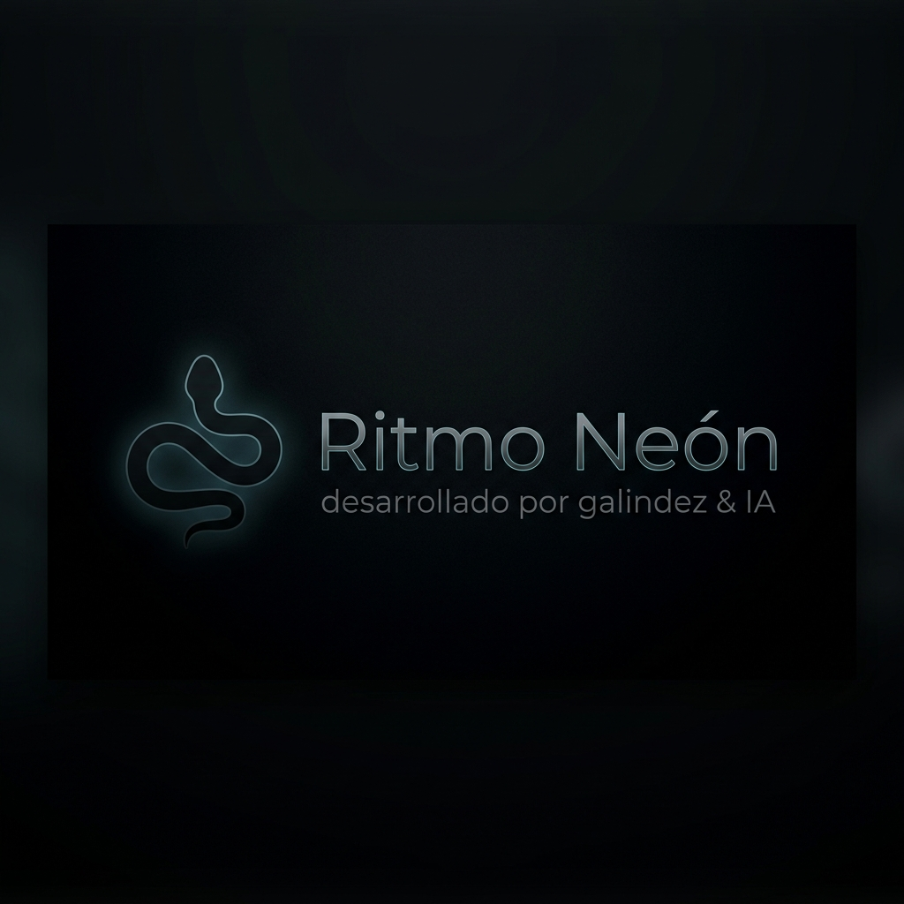

<div align="center">
  
  
  # 🐍 Ritmo Neón Serpiente
  
  **Un tributo cyberpunk moderno al clásico juego de la serpiente.**
  
  [**🎮 JUEGA AHORA EN VIVO**](https://ritmo-ne-n-serpiente-727131753810.us-west1.run.app/)

</div>

---

## 🌟 Descripción

**Ritmo Neón** revoluciona el clásico juego de Snake combinando un diseño **cyberpunk** y *glassmorphism* con mecánicas de aumento progresivo de dificultad. El juego presenta controles responsivos tanto para teclado en computadora como mediante deslizamiento y D-pad virtual para dispositivos móviles, junto a un reproductor de música lofi/chillwave integrado.

El proyecto está diseñado pensando en la optimización con un motor propio usando el `<canvas>` nativo de HTML5 para lograr un flujo de pantalla (FPS) perfecto y sin retrasos (lag), ideal para su alta dificultad. Todo envuelto en un despliegue optimizado por contenedores en GCP.

## 🚀 Arquitectura del Proyecto

El sistema está construido bajo los siguientes pilares tecnológicos y arquitectónicos:

- **Framework y UI**: 
  - Desarrollado como una *Single Page Application (SPA)*.
  - Basado en **React 19** y empaquetado con **Vite** para una carga inicial ultrarrápida.
  - Tipado de datos estricto e interfaces usando **TypeScript**.
  - Estilizado utilizando **Tailwind CSS V4** (configuración de neones personalizados vía utilidades arbitrarias) apoyado en animaciones de **Motion (framer-motion)**.
  
- **Motor Gráfico y Logica**:
  - Un bucle de renderizado `requestAnimationFrame` enlazado con la API Canvas en 2D que aísla visualmente el estado matemático alojado en `setInterval` para impedir caída de frames.
  
- **Persistencia de Datos**:
  - Implementación híbrida de tabla de puntuaciones (Leaderboard). 
  - Una **API REST sin servidor** usando `SheetDB` almacena y devuelve de forma persistente los mejores jugadores del mundo; implementado un "fallback" automático a base de `localStorage` para almacenamiento persistente del mismo dispositivo temporal previendo caídas de red.

- **Infraestructura y Despliegue Automático (CI/CD)**:
  - Encontrándose desplegado en Google Cloud Run a través de **Google Cloud Build** (`cloudbuild.yaml`).
  - Utiliza un `Dockerfile` en configuración multietapa (*multi-stage build*). Compilar todo usando Alpine Node y hospedar exclusivamente los recursos estáticos binarios minimizados sobre un servidor **Nginx** superligero ajustado para el puerto `8080`, resultando en un contenedor final veloz y de bajo consumo.

## 🕹️ Cómo Jugar

1. **Escritorio**: Utiliza las **Flechas del Teclado** o las teclas **W A S D** para guiar a la serpiente. Presiona **Espacio** o **P** para pausar/reanudar.
2. **Móviles**: Tienes a tu disposición controles de D-pad táctiles o soporte nativo para **Swipe** (deslizado) directo sobre la pantalla del juego. Toca el botón de Pausa para detener momentáneamente la partida.
3. Come las esferas de energía (comida) para ir subiendo de rango. ¡Cuidado al ir ganando puntuación, los escenarios mutarán apareciendo barreras y aumentando la velocidad drásticamente!

## ⚙️ Correr en Local (Desarrollo)

Siga estas instrucciones para preparar, instalar y probar el entorno a nivel local de forma rápida:

**Requisitos Previos:** Asegúrate de tener instalado en tu computadora **Node.js** (versión 18+ recomendada) y Git.

1. **Clonar e Ingresar al repositorio**:
   ```bash
   git clone https://github.com/tu-usuario/JuegoSerpiente.git
   cd JuegoSerpiente
   ```

2. **Instalar Dependencias**:
   ```bash
   npm install
   ```

3. **Ejecutar el Servidor de Desarrollo**:
   ```bash
   npm run dev
   ```

4. **Visualizar el Proyecto**:
   Abre una pestaña en tu navegador hacia [http://localhost:3000](http://localhost:3000) o sigue el enlace directamente en la terminal para previsualizar Ritmo Neón Serpiente.

## 📜 Licencia y Créditos

Proyecto desarrollado por **Galindez**. Los efectos de sonido y la música chillwave Lofi utilizados para la ambientación han sido obtenidos libre y gratuitamente a través de la CDN de Pixabay, estando totalmente exentos de Copyright para permitir una experiencia pura en cualquier tipo de retransmisión y despliegue público.
